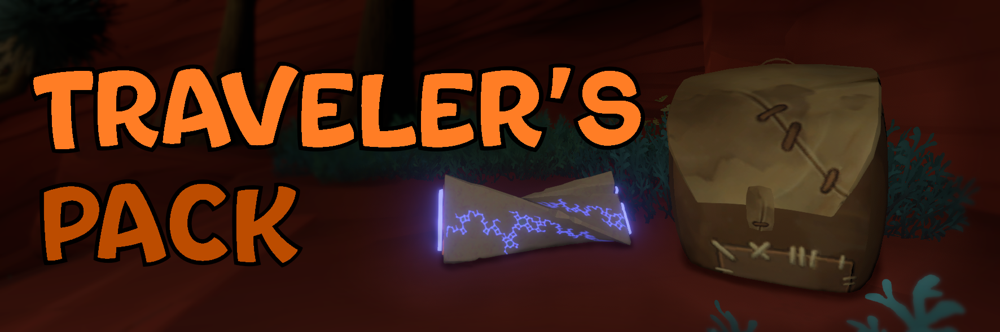

Gives you a placeable backpack to store items in. Now you can transport all of your items with ease!

- To place the backpack, stand on a solid surface and press the button shown on the top-left button prompt. If you're currently interacting with something, you won't be able to place it down.

  - If the keybind to place the backpack overlaps with another control, try changing it in the mod settings.

- You can store items in it by holding them and interacting with the backpack. When you have multiple items stored, you can cycle between them using the left and right tool buttons.

- The backpack can only store 9 items. You'll have to carry the 10th item by hand!

- The backpack has a map marker in case you leave it somewhere by accident. If it gets in the way or you like the idea of being able to lose all of your items, you can turn it off in the mod settings.

- You can use this mod with Quantum Space Buddies, but everyone will share the same backpack. Whoever is hosting the game will start with it, and after that the backpack can be placed down and given to anyone else in the game.